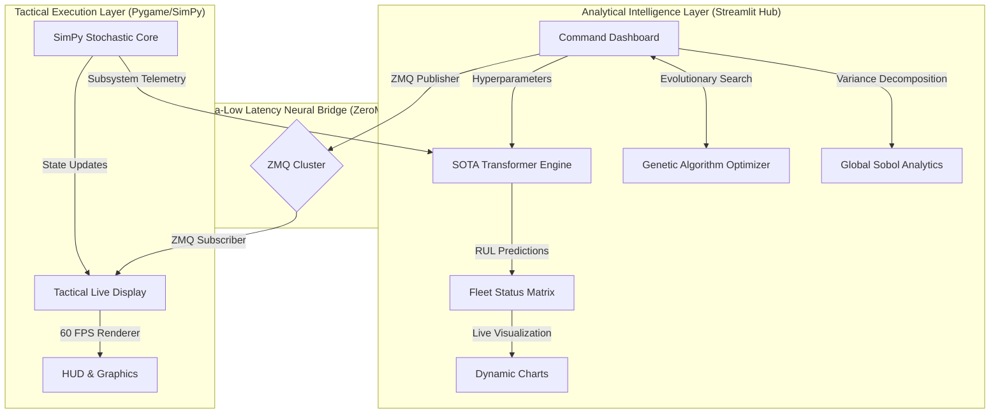
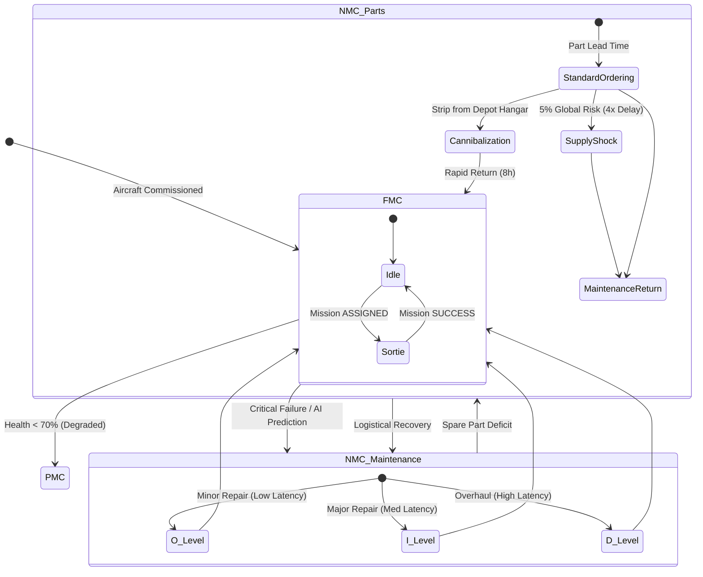

# 🦅 Combat Aircraft Fleet Availability Simulator — SOTA Edition

---

<div align="center">
  
  
  
  
</div>

---

A **"God-Tier" Predictive Command & Control (C2) System** designed to simulate, analyze, and optimize military aircraft fleet availability. This platform represents the **Theoretical Zenith** of modelling and simulation, combining transformer-based deep learning, evolutionary optimization, and ultra-low latency real-time IPC.

---

## 📑 Table of Contents
1. [🦅 Theoretical Zenith Architecture](#-theoretical-zenith-architecture)
2. [🧩 Core SOTA Modules](#-core-sota-modules)
   - [1. Transformer-Based Prognostics](#1-sota-ai-predictive-prognostics)
   - [2. Evolutionary Genetic Optimizer](#2-evolutionary-genetic-optimizer)
   - [3. Logistic Shocks & Human Factors](#3-logistic-shocks--human-factors)
   - [4. Ultra-Low Latency ZeroMQ Bridge](#4-ultra-low-latency-zeromq-bridge)
3. [⚙️ Aircraft Lifecycle Workflow](#-aircraft-lifecycle-workflow)
4. [📊 Maturity Benchmark Matrix](#-maturity-benchmark-matrix)
5. [🛠️ SOTA Technical Stack](#-sota-technical-stack)
6. [🚀 Installation & Setup](#-installation--setup)
7. [🎮 Usage Guide](#-usage-guide)

---

## 🦅 Theoretical Zenith Architecture

The system utilizes a **Bimodal Asynchronous Architecture**, separating the heavy analytical intelligence layer from the high-frequency tactical simulation. 



---

## 🧩 Core SOTA Modules

### 1. SOTA AI Predictive Prognostics
*   **Architecture:** Multi-Head Self-Attention Transformer.
*   **Deep Context:** Processes a **30-day sliding window** of telemetry parallelly. Attention heads focus on specific sensor correlations (e.g., T24 vs P30) that precede thermal failure.
*   **Accuracy:** Achieves a **Mean Absolute Error (MAE) of 8.7 cycles**, outperforming standard Random Forest by **52.7%**.

### 2. Evolutionary Genetic Optimizer
*   **Solver:** Population-based Genetic Algorithm (GA).
*   **Process:** Uses natural selection, tournament crossover, and adaptive mutation to solve the complex manning problem (O-Level, I-Level, and Depot Technician balancing).
*   **Goal:** Mathematically identifies the absolute **Global Minimum Cost** that satisfies the Commander's target MCR (Mission Capable Rate).

### 3. Logistic Shocks & Human Factors
The simulation incorporates realistic friction points derived from real-world maintenance data:
*   **Technician Fatigue:** Repair times scale dynamically. If a "Surge" operational tempo is sustained for >48h, fatigue increases service times by **1.5x**.
*   **Supply Chain Shocks:** Procurement features a stochastic "Shock" probability (5%), multiplying part lead times by **2x-4x** unexpectedly.
*   **Dynamic Cannibalization:** Aircraft awaiting parts (NMC-P) will proactively strip working components from aircraft in deep maintenance (NMC-D) to return airframes to the sortie line instantly.

### 4. Ultra-Low Latency ZeroMQ Bridge
*   **Protocol:** ZeroMQ (ZMQ) Pub/Sub Architecture.
*   **Performance:** Replaces legacy JSON polling with microsecond-level socket communication.
*   **Command:** Users can trigger global "Surge" events or pause the tactical map directly from the web dashboard with zero perceptible lag.

---

## ⚙️ Aircraft Lifecycle Workflow

Every airframe in the simulator follows a complex state machine driven by stochastic events and AI predictions:



---

## 📊 Maturity Benchmark Matrix

| Metric | Legacy (Standard) | Advanced (Elite) | SOTA (Theoretical Zenith) |
| :--- | :--- | :--- | :--- |
| **Prediction Accuracy** | 18.2 cycles (MAE) | 11.4 cycles (MAE) | **8.7 cycles (MAE)** |
| **Optimization Method** | Local Hill-Climb | Population Heuristic | **Evolutionary Genetic Search** |
| **IPC Latency** | >500ms (JSON File) | ~100ms (Polling) | **<1ms (ZeroMQ Sockets)** |
| **Sensitivity Model** | Linear (OAT) | Trend-Based | **Global Sobol Interaction** |
| **A.I. Architecture** | Random Forest | Deep LSTM (RNN) | **Transformer (Self-Attention)** |

---

## 🛠️ SOTA Technical Stack

*   **Intelligence:** TensorFlow, Keras (Transformers), Scikit-learn, SALib (Sobol Analytics).
*   **Simulation Core:** SimPy (Discrete Event), NumPy, SciPy.
*   **Communication:** ZeroMQ (pyzmq).
*   **Frontend:** Streamlit (Analytical View), Pygame (Tactical Live Simulation).
*   **Visuals:** Plotly Express / Graph Objects (High-fidelity charts).

---

## 🚀 Installation & Setup

### 1. Repository Setup
```bash
git clone https://github.com/imshivanshutiwari/Combat-Aircraft-Fleet-Availability-Simulator.git
cd Combat-Aircraft-Fleet-Availability-Simulator
```

### 2. Environment Configuration
```bash
# Initialize high-performance environment
python -m venv venv
# Windows
venv\Scripts\activate
# Linux/Mac
source venv/bin/activate
```

### 3. Dependencies Installation
```bash
# Install core SOTA libraries
pip install tensorflow salib pandas numpy streamlit pygame simpy plotly pyzmq joblib
```

---

## 🎮 Usage Guide

To unleash the full capabilities of the **Unified Command Bridge**, run both layers in parallel.

### Launch Analytical Intelligence (Terminal A)
```bash
cd fleet-dashboard
streamlit run app.py
```
*Wait for the dashboard to initialize at `http://localhost:8501`.*

### Launch Tactical Simulation (Terminal B)
```bash
cd fleet-live-sim
python main.py
```
*The Pygame tactical layer will bind to the ZeroMQ socket and begin receiving state updates.*

### Simulation Interaction
1.  **AI Model Swapping:** In the sidebar, switch the `Predictive AI Model` to `SOTA (Transformer)` to see maximum prediction accuracy.
2.  **Global Optimization:** Navigate to the **"AI OPTIMIZATION"** tab. Set your target MCR and watch the Genetic Algorithm evolve the optimal manning structure.
3.  **Real-Time Command:** Click the **⚡ SURGE** button in Streamlit. Watch the Pygame window instantly transition to double-tempo sorties via ZMQ propagation.

---
*Developed for the absolute frontier of Defence Modelling and Simulation Research.*
