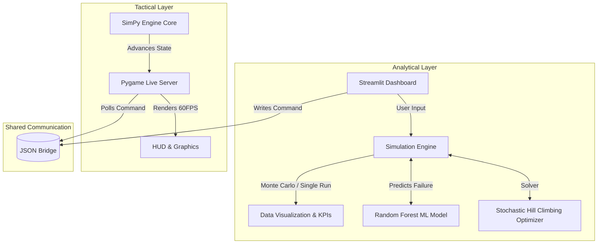
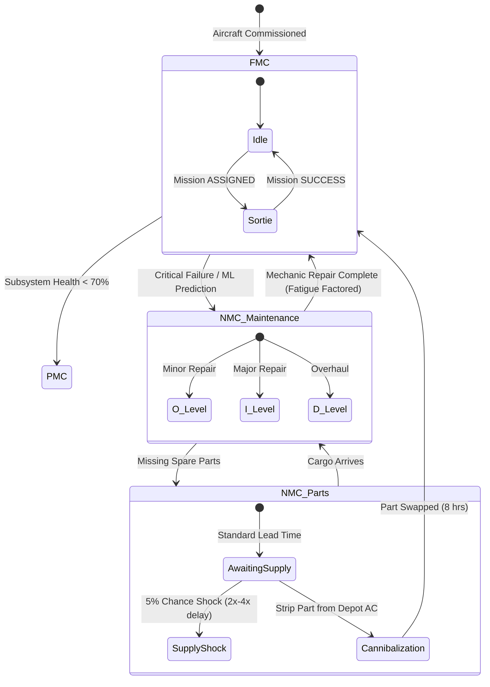

# 🦅 Combat Aircraft Fleet Availability Simulator

[](https://www.python.org/downloads/)
[](https://streamlit.io/)
[](https://www.pygame.org/)
[](https://opensource.org/licenses/MIT)

A state-of-the-art **Predictive Command & Control System** designed to simulate, analyze, and optimize military aircraft fleet availability. Combining discrete-event simulation, machine learning, and real-time tactical visualization, this platform enables commanders and logistics officers to make data-driven decisions under uncertainty.

---

## 📑 Table of Contents
1. [Project Architecture](#-project-architecture)
2. [Core Modules](#-core-modules)
   - [A.I. Predictive Engine](#1-ai-predictive-engine)
   - [Autonomous Decision Support (Optimizer)](#2-autonomous-decision-support-optimizer)
   - [High-Fidelity Logistics & Human Factors](#3-high-fidelity-logistics--human-factors)
   - [Unified Command Bridge](#4-unified-command-bridge)
3. [System Workflow](#-system-workflow)
4. [Installation & Setup](#-installation--setup)
5. [Usage Guide](#-usage-guide)

---

## 🏗️ Project Architecture

The system is split into two asynchronous, communicating applications: an analytical **Streamlit Dashboard** and a real-time **Pygame Tactical Display**.



---

## 🧩 Core Modules

The project boasts **Maturity Level 4: Elite Predictive Command & Control**, featuring the following high-fidelity components:

### 1. A.I. Predictive Engine
*   **Data Source:** NASA C-MAPSS FD001 dataset.
*   **Algorithm:** `RandomForestRegressor` predicting Remaining Useful Life (RUL).
*   **Functionality:** Generates dynamic, simulated sensor noise based on hidden subsystem health. The ML model interprets this telemetry to predict impending failures, replacing static Weibull statistical curves.

### 2. Autonomous Decision Support (Optimizer)
*   **Solver:** Stochastic Hill-Climbing algorithm.
*   **Goal:** Mathematically determines the exact lowest-cost technician manning structure (O-Level, I-Level, Depot) required to hit a Commander-defined target Mission Capable Rate (MCR).
*   **Integration:** Runs live against the simulation core, testing thousands of configurations instantly.

### 3. High-Fidelity Logistics & Human Factors
*   **Technician Fatigue:** Repair times scale dynamically. If a "Surge" operational tempo is sustained for >48 hours, fatigue sets in, increasing repair times up to 1.5x.
*   **Supply Chain Shocks:** Procurement features a stochastic probability of massive delays, multiplying part lead times by 2x-4x unpredictably.
*   **Dynamic Cannibalization:** Aircraft awaiting parts (NMC-Parts) will proactively strip working parts from aircraft in deep maintenance (NMC-Depot), instantly returning airframes to the fight.

### 4. Unified Command Bridge
*   **Asynchronous IPC:** Uses a lightweight JSON bridge (`shared_bridge.json`) to connect the Python web dashboard with the local C++ optimized Pygame instance.
*   **Remote Command:** Users can trigger global "Surge" events or pause the tactical map directly from their web browser.

---

## ⚙️ System Workflow

The following flowchart details the lifecycle of an aircraft passing through the discrete-event simulation:



---

## 🚀 Installation & Setup

### Prerequisites
* Python 3.12 or higher.
* Git

### Step 1: Clone Repository
```bash
git clone https://github.com/imshivanshutiwari/Combat-Aircraft-Fleet-Availability-Simulator.git
cd Combat-Aircraft-Fleet-Availability-Simulator
```

### Step 2: Set up Virtual Environment
```bash
python -m venv venv
# On Windows
venv\Scripts\activate
# On macOS/Linux
source venv/bin/activate
```

### Step 3: Install Dependencies
Navigate into both application folders and install the required packages.
```bash
# Dashboard Dependencies (Streamlit, Scikit-learn, Plotly, Pandas)
pip install -r fleet-dashboard/requirements.txt

# Live Sim Dependencies (Pygame, Simpy)
pip install -r fleet-live-sim/requirements.txt
```

---

## 🎮 Usage Guide

To unleash the full capabilities of the **Unified Command Bridge**, run both applications simultaneously in separate terminal windows.

### Terminal 1: Launch Analytical Dashboard
```bash
cd fleet-dashboard
streamlit run app.py
```
*Wait for the dashboard to compile and open `http://localhost:8501` in your browser.*

### Terminal 2: Launch Tactical Pygame Display
```bash
cd fleet-live-sim
python main.py
```
*This will open the 60FPS graphical tactical layout.*

### Using the System
1. **Analyze:** Use the Streamlit web interface to run Monte Carlo simulations, perform Surge analysis, and view historical C-MAPSS telemetry data.
2. **Optimize:** Open the **AI OPTIMIZATION** tab. Enter your desired MCR (e.g., 75%), max iterations, and click "Run AI Solver". The system will output the cheapest manning configuration possible.
3. **Command:** While the Pygame window is running, go to the left sidebar of the Streamlit dashboard under **PYGAME LIVE LINK**. Click **⚡ SURGE** to send an asynchronous command across the JSON bridge and watch the Pygame map instantly react to the doubled operational tempo.

---
*Developed for advanced operational modeling and logistics simulation research.*
