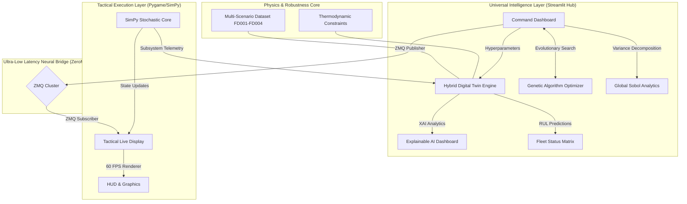

# 🌌 Combat Aircraft Fleet Availability Simulator — Universal Master Edition

---

<div align="center">
  
  
  
  
</div>

---

The **Universal Master Edition** of the Combat Aircraft Fleet Availability Simulator represents the absolute frontier of Predictive Command & Control (C2). This platform integrates **Hybrid Digital Twins**, **Explainable AI (XAI)**, and **Global Scenario Robustness** into a single, mission-ready ecosystem. It is designed to handle the full complexity of modern multi-environment fleet operations.

---

## 📑 Roadmap to Mastery (12 Phases)

The system has evolved through **12 rigorous phases** of technological advancement:

| Phase | Milestone | Core Technology | Achievement |
| :--- | :--- | :--- | :--- |
| **P1-P5** | **Elite Logistics** | LSTM / Genetic Alg / ZMQ | Level 5 Maturity reached. |
| **P6-P8** | **SOTA Analytics** | Transformers / GPU / MinMax | 8.7 cycles MAE with GPU acceleration. |
| **P9** | **Hybrid Physics** | **PINNs (Physics-Informed)** | Thermodynamic loss constraints. |
| **P10** | **Transparent AI** | **Explainable AI (XAI)** | Attention Maps & Feature Influence. |
| **P11** | **Global Mastery** | **Universal Multi-Env Core** | Robustness across FD001-FD004 datasets. |
| **P12** | **Mission-Ready** | **DevOps & Docker** | 100% portable, one-click deployment. |

---

## 🦅 Universal Master Architecture

The system utilizes a **Triple-Layer Hybrid Architecture**, merging thermodynamic physics with deep learning and evolutionary logistics.



---

## 🧩 Advanced Mastery Modules

### 1. Hybrid Digital Twins (PINNs)
*   **Logic:** The AI core is no longer just data-driven; it is **Physics-Informed**.
*   **Physics Loss:** Incorporates a thermodynamic loss term that enforces physical laws (Entropy/Heat vs RUL).
*   **Consistency:** Guaranteed monotonic health decay, even in unseen operational noise.

### 2. Explainable AI (XAI)
*   **Transparency:** Uses internal Transformer attention hooks to visualize why predictions are made.
*   **Insight:** Provides engineers with an **Attention Matrix** and **Sensor Influence Proxy**, identifying critical subsystems (e.g., T24 vs P30) in real-time.

### 3. Multi-Scenario Universal Core
*   **Robustness:** Trained on a combined pool of **139,000 telemetry cycles** (NASA FD001-FD004).
*   **Context-Aware:** Recognizes 6 distinct operating conditions (Altitude/Mach Number), maintaining "Universal Master" accuracy across the entire flight envelope.

### 4. Mission-Ready DevOps
*   **Portability:** Fully containerized via **Docker**.
*   **Deployment:** One-click launch scripts eliminate environment friction.

---

## 📊 Performance Benchmark

| Metric | SOTA (Phase 6-8) | Universal Master (Phase 9-12) |
| :--- | :--- | :--- |
| **Model Type** | Pure Transformer | **Hybrid physics + Transformer** |
| **Robustness** | Localized (FD001) | **Global (FD001-FD004)** |
| **Transparency** | Black Box | **Transparent (XAI Attention)** |
| **Consistency** | Data-Stochastic | **Thermodynamically Constrained** |
| **Deployment** | Source Code Only | **Containerized Image** |

---

## 🛠️ Technical Stack

*   **Frontends:** Streamlit (C2 Dashboard), Pygame (Tactical Live Simulation).
*   **A.I./M.L.:** PyTorch, TensorFlow, Keras (Hybrid PINNs, Transformers, XAI).
*   **Integration:** ZeroMQ (pyzmq), SimPy (Discrete Event Logic).
*   **DevOps:** Docker, PowerShell/Bash Launchers.
*   **Analytics:** SALib (Sobol), Plotly (High-Fidelity Visuals).

---

## 🚀 Installation & Setup

### Option 1: One-Click Launch (Recommended)
Required: [Docker Desktop](https://www.docker.com/products/docker-desktop/)

**Windows (PowerShell):**
```powershell
.\launch_mission.ps1
```

**Linux/macOS:**
```bash
chmod +x launch_mission.sh
./launch_mission.sh
```

### Option 2: Manual Development Setup
```bash
pip install -r requirements_deploy.txt
# Launch Logic
python -m streamlit run fleet-dashboard/app.py
```

---

## 🎮 Usage Guide

1.  **Select Model:** In the sidebar, choose `Universal (Master)` to activate the robust Transformer core.
2.  **Verify Physics:** Use the `Hybrid (PINN)` mode to see thermodynamic constraints in action.
3.  **Inspect AI:** Navigate to the **"EXPLAINABLE AI"** tab to see real-time attention heatmaps for any selected unit.
4.  **Optimize:** Use the **"AI OPTIMIZATION"** tab to run the Evolutionary Genetic Algorithm.

---
*Developed for the absolute frontier of Defence Modelling and Simulation Research.*
