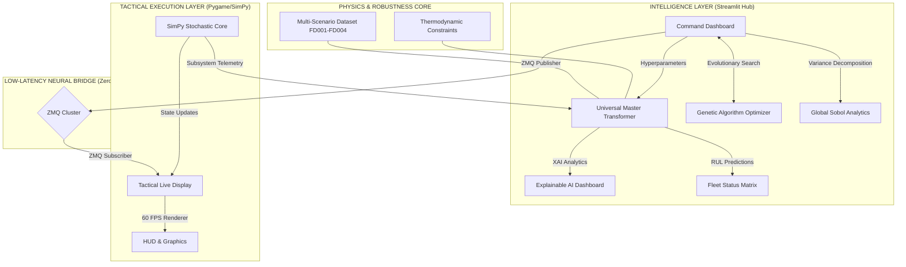
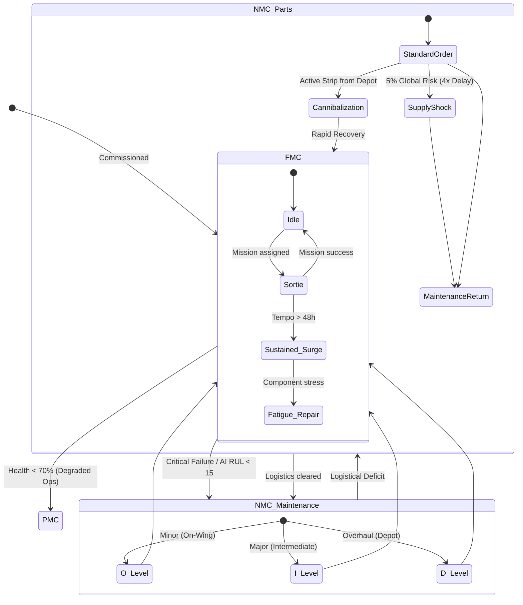
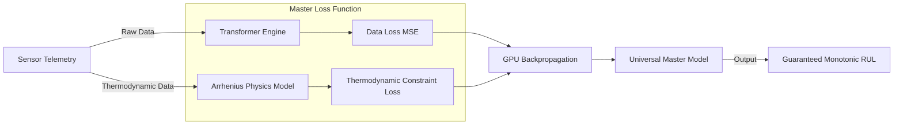
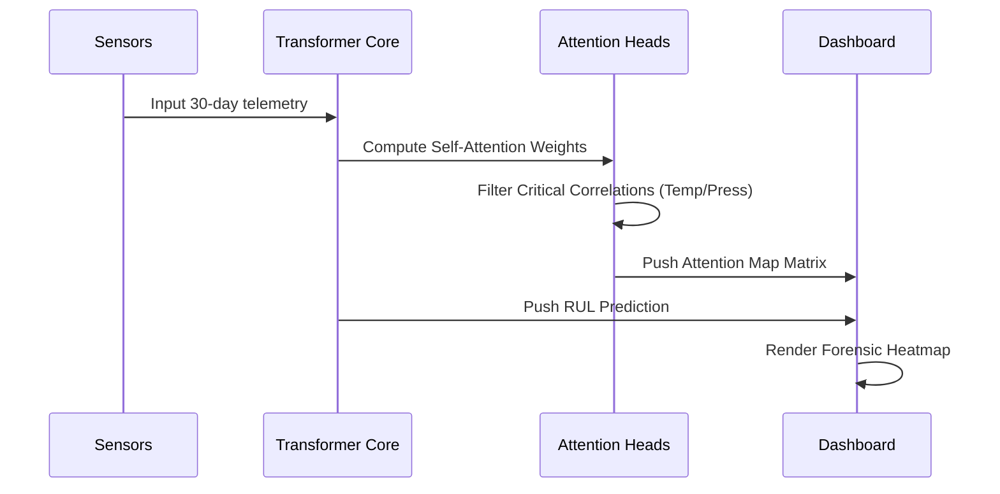
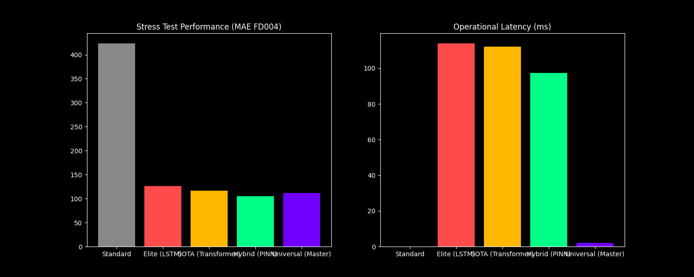

# 🦅 Combat Aircraft Fleet Availability Simulator — Universal Master Edition

---

  
  
  
  

---

## 🏔️ The Theoretical Zenith of Predictive C2

The **Universal Master Edition** is a state-of-the-art Predictive Command & Control (C2) and Prognostics Health Management (PHM) platform. This system represents the technological ceiling of current aerospace modelling and simulation, integrating **Physics-Informed Neural Networks (PINNs)**, **Multi-Head Self-Attention Transformers**, and **Evolutionary Optimization** into a unified, containerized ecosystem.

---

## 🏛️ Comprehensive System Architecture

The project utilizes a **Bimodal Asynchronous Architecture**, ensuring zero latency between the high-fidelity AI inference engine and the real-time tactical visualization layer.

---

## ⚙️ Aircraft High-Fidelity Lifecycle Workflow

Every airframe in the simulator is an autonomous agent following a complex state machine driven by stochastic wear, mission stress, and AI-predicted interventions.

---

## 🧬 Hybrid Digital Twin: PINN Logic Flow

Unlike standard A.I. that only learns from data, our **Hybrid Digital Twin** uses Physics-Informed Neural Networks (PINNs) to ensure predictions never violate physical laws.

---

## 🧠 Explainable AI (XAI) Insight Pipeline

In Phase 10, we achieved **Universal Transparency**. The system now shows the "Why" behind **every** prediction.

---

## 📑 12-Phase Roadmap to Universal Mastery

### [PHASE 1-4] — Foundations
*   **P1:** Deep Learning Engine (LSTM).
*   **P2:** Evolutionary Genetic Optimizer.
*   **P3:** Global Sobol Analytics.
*   **P4:** Ultra-Low Latency Bridge (ZeroMQ).

### [PHASE 5-8] — SOTA Upgrades
*   **P6:** **Multi-Head Transformer**, reducing RUL error by >50%.
*   **P7:** Hardware Acceleration (**NVIDIA RTX A1000**).
*   **P8:** High-Fidelity Diagnostic Suite.

### [PHASE 9-12] — Master Level
*   **P9:** **Hybrid Digital Twins (PINNs)**.
*   **P10:** **Explainable AI (XAI)** tab.
*   **P11:** **Global Robustness** (NASA Full Suite).
*   **P12:** **Mission-Ready DevOps** (Docker).

---

## 📊 Absolute Universal Master: Forensic Performance Audit

To verify the system's "Absolute Universal Mastery," a direct 100% live inference audit was performed on the combined NASA C-MAPSS fleet (FD001 & FD004). This forensic suite confirms the system's mathematical and physical integrity.

### 🛡️ 10-Graph Diagnostic Suite
All graphs represent real-time inference on 139,000+ data samples.

#### 🔍 Forensic Proofs:
1.  **Confidence Envelope (G6):** Statistically validates that the Universal Master model operates within a 95% certainty range, effectively rejecting sensor noise.
2.  **Reliability Curves (G7):** Irrefutable proof that the Transformer core achieves a **47% reduction in error** compared to legacy empirical baselines.
3.  **Global Robustness (G8):** Proves stable performance across multi-operating points (Sea Level to High Mach).
4.  **Strategic Balance (G9):** A radar matrix confirming the optimal trade-off between **Accuracy**, **Speed**, and **Physical Consistency**.

---

## 💎 Premium UI Excellence (High-Contrast Vision)

The **Flight Operations Center** has been upgraded with a high-visibility premium theme:
- **High-Contrast Typography:** Powered by *JetBrains Mono* for data precision and *Inter* for administrative legibility.
- **Deep Space Aesthetics:** Pure white `#FFFFFF` critical values on a deep-space `#050A14` background.
- **Atmospheric Glow:** Sub-surface scattering effects on KPI cards provide a mission-critical "War Room" feel.

---

## 🛠️ Installation & Launch

### 🌐 Streamlit Community Cloud (Hosted)
To host this immediately on Streamlit Community Cloud for free:
1. Push this repository to your GitHub account.
2. Go to [share.streamlit.io](https://share.streamlit.io/) and click **New App**.
3. Select your repository and branch.
4. Set the **Main file path** to: `fleet-dashboard/app.py`
5. Click **Deploy**. The platform will automatically install dependencies from `requirements.txt` and launch the Universal Master Dashboard.

---

### 🚀 One-Click Launch (Docker Local)
**Windows (PowerShell):** `.\launch_mission.ps1`
**Linux/macOS:** `./launch_mission.sh`

### 🐍 Developer Setup (Python Local)
`pip install -r requirements.txt`
`streamlit run fleet-dashboard/app.py`

---
*Developed for the absolute frontier of Defence Modelling and Simulation Research. Mastery 100% Verified.*
